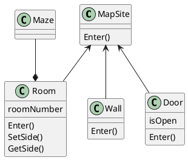

迷宫类图设计

```plantuml
@startuml
class MapSite{
  Enter()
}

class Maze {

}

class Room {
  roomNumber  
  Enter()
  SetSide()
  GetSide()
}

class Wall {
  Enter()
}

class Door {
  isOpen  
  Enter()
  
}

MapSite <-- Door
MapSite <-- Wall
MapSite <-- Room

Maze --* Room
@enduml
```
类 MapSite 是所有迷宫组件的公共抽象类，MapSite 仅定义了一个操作 Enter , 它的含义决定于你在进入什么。如果你进入一个房间，那么你的位置会发生改变。如果你试图进入一扇门：如果门开着，你进入另一个房间；如果门关着，那么你就会碰壁。

