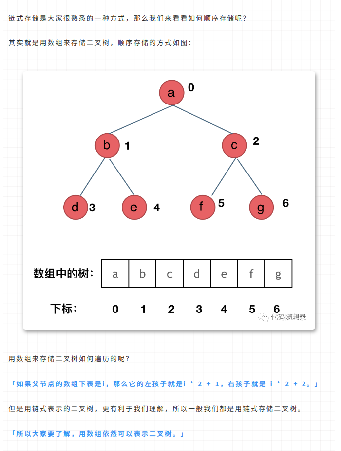

参考：https://mp.weixin.qq.com/s/_ymfWYvTNd2GvWvC5HOE4A

# 二叉树的种类

### 满二叉树
### 完全二叉树
堆就是一颗完全二叉树
### 二叉搜索树，有序树
### 平衡二叉搜索树
C++中map、set、multimap，multiset的底层实现都是平衡二叉搜索树，所以map、set的增删操作时间时间复杂度是logn，注意我这里没有说unordered_map、unordered_set，unordered_map、unordered_map底层实现是哈希表（O(1)）。

# 二叉树的存储方式
二叉树可以链式存储，也可以顺序存储。

那么链式存储方式就用指针， 顺序存储的方式就是用数组。



# 二叉树的遍历方式

深度优先：（根节点的）前中后序
前序遍历：中左右
中序遍历：左中右
后序遍历：左右中


广度优先：层序遍历


# 二叉树的定义
``` cpp
struct TreeNode {
    int val;
    TreeNode *left;
    TreeNode *right;
    TreeNode(int x) : val(x), left(nullptr), right(nullptr) {}
};
```

# N叉树的遍历

深度优先： 前后序
广度优先： 层序

# N叉树的定义
``` cpp
class Node {
public:
    int val;
    vector<Node*> children;

    Node() {}
    Node(int _val) {
        val = _val;
    }
    Node(int _val, vector<Node*> _children) {
        val = _val;
        children = _children;
    }
};
```